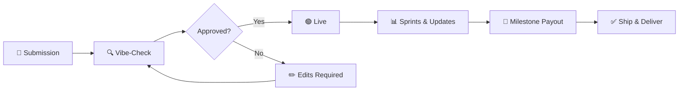

<div align="center">


### Crowdfunding with proof — built for AI-assisted solo developers, indie -hackers and vibe-coders.

[](https://vibebackers.io)
[](https://nextjs.org)
[](https://typescriptlang.org)
[](https://stripe.com)
[](https://github.com)

<br />

**VibeBackers.io** is a "Proof of Vibe" funding platform for the AI-native developer economy.  
A discovery hub and funding rail where builders who ship with AI launch projects,  
and backers support them based on **verifiable progress** — not pitch decks or promises.

[🌐 Website](https://vibebackers.io) · [📖 Documentation](#-table-of-contents) · [🐛 Report Bug](https://github.com/vibebackers/vibebackers/issues)

<br />


</div>

<br />

> [!IMPORTANT]
> **"Proof of Work is the only vibe that matters."**  
> No GitHub verification = no campaign. No shipping = no full payout. No updates = funding at risk.

<br />

---

## 📑 Table of Contents

- [The Problem](#-the-problem)
- [How It Works](#-how-it-works)
- [Platform Philosophy](#-platform-philosophy)
- [Who It's For](#-who-its-for)
- [Campaign Lifecycle](#-campaign-lifecycle)
- [For Builders](#-for-builders)
- [For Backers](#-for-backers)
- [Features](#-features)
- [Funding Model](#-funding-model)
- [GitHub Verification](#-github-verification)
- [Milestones & Vibe Sprints](#-milestones--vibe-sprints)
- [Tech Stack](#%EF%B8%8F-tech-stack)
- [Integrations](#-integrations)
- [Reward System](#-reward-system)
- [Current Status](#-current-status)

---

## 🔥 The Problem

The rise of AI-assisted coding ("vibe coding") has created a new category of developer — **one person who can build what previously required a 10-person team.** But funding infrastructure hasn't kept pace.

| Problem | How VibeBackers Solves It |
|:---|:---|
| 🕳️ **The Trust Gap** — Traditional crowdfunding relies on videos and text pitches with no proof of progress | Backers get **verified proof** that real progress is being made before more funding is released |
| 🚫 **VC Gatekeeping** — Solo AI developers are too small for VC but too technical for generic crowdfunding | A streamlined way to **raise capital directly** from your audience |
| 🐌 **Slow Capital** — Platforms like Kickstarter have zero accountability mechanisms for software | **Structured review, GitHub verification, and milestone-based fund release** that moves at AI speed |

---

## ⚡ How It Works

```
┌─────────────┐       ┌─────────────┐      ┌─────────────┐      ┌─────────────┐
│  🔨 BUILD   │────▶│  ✅ VERIFY  │────▶│  💰 FUND    │────▶│  🚀 SHIP    │
│  Create your │     │  Connect    │      │  Backers     │      │  Post Vibe  │
│  campaign    │     │  GitHub &   │      │  pledge to   │      │  Sprints &  │
│  with proof  │     │  prove it   │      │  support you │      │  get paid   │
└─────────────┘      └─────────────┘       └─────────────┘      └─────────────┘
```

<div align="center">

**Funds are never handed over in a lump sum.**  
Payment methods are saved first → collection begins only if the goal is met → payouts release across **3 milestone tranches** with backer review.

</div>

---

## 🧭 Platform Philosophy

Every element of VibeBackers is designed around one principle: **verified progress.**

- 🔐 **No GitHub verification = no campaign.** Creators must cryptographically prove repository ownership before going live.
- 📦 **No shipping = no automatic full payout.** Later releases depend on verifiable proof and backer review.
- 🔔 **No updates = funding at risk.** Silence triggers an automatic hold via the **14-Day Heartbeat Rule**.
- 🗳️ **Backers have real power.** They can dispute milestone payouts, vote to withhold releases, and report campaigns.

### 🏅 The Vibe Scout Identity

Backers are called **"Vibe Scouts"** — early supporters hunting for the next big AI-native tool. Every project you fund mints a permanent, serialised digital trophy on your public profile. The first backer on any campaign becomes **Backer #001** — a permanent mark of early belief.

---

## 👥 Who It's For

<table>
<tr>
<td width="33%" align="center">

### 👀 Visitors

Browse the homepage, project listings, leaderboards, and profiles — **no account required.**

</td>
<td width="33%" align="center">

### 🏕️ Backers (Vibe Scouts)

Early adopters who back the next generation of AI software. **Vote on milestones, dispute releases, and request updates.**

</td>
<td width="33%" align="center">

### 🛠️ Builders (Creators)

AI-native developers who use Cursor, Windsurf, or Bolt to ship at high velocity. **Connect GitHub, get verified, get funded.**

</td>
</tr>
</table>

---

## 🔄 Campaign Lifecycle



| Stage | Description |
|:---|:---|
| **1. Submission & Trust Setup** | Builder submits campaign with connected GitHub repo, optional demo & video |
| **2. The Vibe-Check** | Automated trust & safety pass + manual platform review |
| **3. Review Queue** | Project stays in review until approved; failures get specific feedback |
| **4. Going Live** | Campaign goes public, funding countdown begins |
| **5. Edit Protection** | Significant changes to live campaigns are re-routed through review |
| **6. Milestone Shipping** | Builders post Vibe Sprints; later tranches require proof + backer vote |

---

## 🛠️ For Builders

<details>
<summary><strong>📋 The Complete Builder Journey (click to expand)</strong></summary>

<br />

| Step | Action | Details |
|:---:|:---|:---|
| **1** | 🔑 Sign Up & Onboard | Create account, set display name, bio, avatar, select "Builder" role |
| **2** | 📝 Create Campaign (Draft) | Title, tagline, description, Vibe Canvas pitch editor, funding goal, deadline, tech stack, maturity level, images, FAQ |
| **3** | 🎁 Set Up Reward Tiers | Price, description, estimated delivery, max backers, optional "Rewardless" tier |
| **4** | 🔗 Connect GitHub & Verify | Verify repository ownership via nonce challenge (README / commit / branch) |
| **5** | 💳 Set Up Payout Account | Connect payment account + complete KYC (payouts blocked until approved) |
| **6** | 📤 Submit for Review | Auto-generated tracking number, 24–48 hour review window, AI-generated risk brief |
| **7** | 🚀 Campaign Goes Live | Published to homepage, Explore page & Leaderboard |
| **8** | 📊 Publish Sprints | Structured progress updates with GitHub commits, demo URLs, walkthrough videos |
| **9** | 🎯 Milestone Submission | Submit sprint as milestone proof → backer review → staged payout release |

</details>

---

## 🏕️ For Backers

<details>
<summary><strong>📋 The Complete Backer Journey (click to expand)</strong></summary>

<br />

| Step | Action | Details |
|:---:|:---|:---|
| **1** | 🔍 Discover Projects | Homepage, Explore (filter/search), Leaderboard (funding, engagement, velocity) |
| **2** | 🧐 Evaluate a Project | Pitch, verification badge, funding bar, sprints, builder profile, "Vibe Velocity" score |
| **3** | 💰 Pledge & Choose Tier | Payment method saved, pledge recorded as intent, assigned sequential Backer Number |
| **4** | 📡 Track Progress | In-app + email notifications for sprints, goal reached, milestone reviews |
| **5** | 🗳️ Vote on Milestones | Review sprint evidence (commits, demo, video) → vote Approve or Reject |
| **6** | ⚠️ Dispute a Milestone | Escalate to platform team with AI-powered proof analysis |
| **7** | 📨 Request an Update | Formally request update from quiet creator (1 open request per campaign) |
| **8** | 🎁 Claim Reward | Complete claim form → receive licence key, Discord access, beta invite, etc. |

</details>

---

## ✨ Features

<table>
<tr>
<td width="50%" valign="top">

### 🛠️ Builder Features

- 📝 Full campaign editor with rich HTML pitch (Vibe Canvas)
- 🎁 Reward tier management with pricing, limits & claim forms
- 🔗 GitHub verification with nonce challenge system
- 💳 Payout account onboarding with KYC
- 📊 Sprint publishing with proof links
- 🎯 Milestone submission for staged payout release
- 📈 Campaign analytics (views, pledges, trends)
- ✏️ Draft editing with re-review on live changes
- 👤 Public builder profile with velocity stats

</td>
<td width="50%" valign="top">

### 🏕️ Backer Features

- 🔍 Project browsing (Homepage, Explore, Leaderboard)
- 💰 Pledging with tier selection
- 📂 Portfolio dashboard for all backed projects
- 🗳️ Milestone voting (approve / reject)
- ⚠️ Milestone dispute escalation
- 📨 Update requests for quiet creators
- 🚩 Campaign reporting for safety/compliance
- 🎁 Reward claiming with custom forms
- 👤 Public Vibe Scout profile with trophy collection
- 🔔 Notification preferences (email / in-app)
- 🔒 Privacy controls for public profile

</td>
</tr>
</table>

---

## 💰 Funding Model

### How Pledging Works

> Backers are **never charged at pledge time.** VibeBackers saves the payment method and only collects if the campaign hits its goal.

```
Backer Pledges  →  Payment Method Saved  →  Goal Met?
                                              │
                                    ┌─────────┴─────────┐
                                    │ ✅ YES             │ ❌ NO
                                    │ Collection begins  │ No charge
                                    │ Funds → payout pool│ Pledges void
                                    └────────────────────┘
```

### 📊 3-Milestone Payout Structure

| Milestone | Payout | Approval | Timing |
|:---:|:---:|:---|:---|
| 🥇 **M1** | **30%** | Automatic after successful close & collection | Immediately after campaign closes |
| 🥈 **M2** | **40%** | Backer-reviewed (>50% approval required) | After creator submits proof sprint |
| 🥉 **M3** | **30%** | Backer-reviewed (>50% approval required) | After creator submits final proof sprint |

> [!NOTE]
> Creator payouts are calculated from **actual collected funds after processing fees**, then released across the three tranches above.

---

## 🔗 GitHub Verification

GitHub verification is a **hard gate** — no software campaign launches without it.

### Why It Exists

It proves two things:

1. ✅ The creator **actually controls** the repository they claim is their project
2. ✅ The repository **actually contains** the software they claim to be building

### 🔐 The Ownership Challenge

The platform generates a unique verification code. The creator embeds it in one of three places:

| Method | How |
|:---|:---|
| 📄 **README** | Paste the code in the repo's README file |
| 💬 **Commit Message** | Make a commit with the code in the message |
| 🌿 **Branch / Tag** | Create a branch or tag using the code as its name |

### 🔎 Multi-Signal Repository Analysis

| Signal | What's Checked |
|:---|:---|
| 🧰 Tech stack match | Does repo config match the declared tech stack? |
| 📖 Description match | Does README content relate to the campaign? |
| 🌐 Demo domain match | Does the demo URL appear in the repo? |
| 🤖 AI confidence score | Overall legitimacy assessment via AI model |

> Mismatches trigger automatic flagging for manual review. OAuth tokens are stored **encrypted, never in plaintext.**

---

## 🏃 Milestones & Vibe Sprints

### 📋 What's a Vibe Sprint?

The primary progress update mechanism. Each sprint includes:

- ✍️ Written title and description
- 🔗 GitHub commit URL (direct proof of code shipped)
- 🌐 Live demo URL (see the running software)
- 🎥 Walkthrough video URL (recorded demo explanation)

### ⏰ The 14-Day Heartbeat Rule

> [!WARNING]
> **Anti Ghosting Mechanism** — If no update or sprint is published for 14 consecutive days, the campaign is automatically flagged and system reminders are sent to the builder.
> Failure to update the backers or provide meaningful Sprints can result in funding being paused.

### 🎯 Milestone Review Flow

```
Creator Submits Sprint as Milestone Proof
              │
              ▼
   🤖 AI Proof Analysis
   (Strong / Partial / Weak / Manual Review)
              │
              ▼
   📬 Backers Notified (7–14 day review window)
              │
              ▼
   🗳️ Backers Vote (Approve / Reject)
              │
       ┌──────┴──────┐
       │ >??% Approve │ Majority Reject
       │ 💸 Payout    │ 🔄 Resubmit
       └──────────────┘
* We use a an internal rubric to calculate number of backers who have voted and a % of backers who vote to determine
if a tranche is successful. We purposly keep this calculation secret to prevent people gaming the platform.
```

---

## 🏗️ Tech Stack

| Layer | Technology | Purpose |
|:---|:---|:---|
| **Frontend** | Next.js (React 19) | App Router, SSR, full web application |
| **Language** | TypeScript | Full-stack type safety |
| **Styling** | Tailwind CSS v4 | Utility-first styling |
| **Database** | PostgreSQL + BaaS | Database, auth, real-time, storage |
| **Payments** | Stripe Connect | Backer payments, creator payouts, staged accounting |
| **Verification** | GitHub OAuth + REST API | Repo ownership & code verification |
| **Email** | AWS SES | Transactional + digest emails |
| **AI Analysis** | Google Gemini 2.5 Flash | Campaign review briefs, milestone proof assessment |
| **Rate Limiting** | Upstash Redis | Sliding-window rate limiting on API routes |
| **Hosting** | Vercel | Frontend deployment & scheduled jobs |
| **Rich Text** | Vibe Canvas (bespoke) | Campaign pitch editor |
| **State** | Zustand | Client-side state management |

---

## 🔌 Integrations

<details>
<summary><strong>💳 Stripe</strong> — All money movement</summary>

<br />

- Backers save payment methods at pledge time (no immediate charge)
- Creators onboard via **Stripe Connect** (marketplace model with sub-accounts)
- Funds collected only after successful campaign close
- Payouts via direct transfer to creator's connected account
- **KYC handled by Stripe** — verified status synced to platform automatically

</details>

<details>
<summary><strong>🐙 GitHub</strong> — Repository verification & commit tracking</summary>

<br />

- OAuth-based read access to creator repositories
- REST API for repo content fetching & ownership challenge verification
- GitHub release events can auto-trigger milestone reviews

</details>

<details>
<summary><strong>📧 AWS SES</strong> — Transactional & digest emails</summary>

<br />

- Immediate transactional emails (pledge confirmation, KYC, campaign approved)
- Hourly batch digest — groups events per user into a single summary
- All emails respect user notification preferences

</details>

<details>
<summary><strong>🤖 Google Gemini AI</strong> — Advisory analysis (server-side only)</summary>

<br />

- **Campaign Review Brief**: Risk assessment & flag generation for platform reviewers
- **Milestone Proof Analysis**: Proof strength rating (Strong / Partial / Weak / Manual Review) with summary
- Neither output is binding — advisory tools for human decision-makers

</details>

<details>
<summary><strong>🛡️ Upstash Redis</strong> — Rate limiting</summary>

<br />

- IP-based sliding-window rate limiting on all significant API endpoints
- Four tiers: strict (auth/sensitive) → lenient (read-heavy)
- Prevents brute-force, credential stuffing, and API abuse

</details>

---

## 🎁 Reward System

Builders create reward tiers during campaign setup. Each tier includes a price, description, estimated delivery date, and optional backer limit.

### Supported Asset Types

| Asset Type | Description |
|:---|:---|
| 🔑 License Key | Software licence key string |
| 💬 Discord Role | Discord role invitation |
| 🐙 GitHub Access | Access to a private repository |
| 📦 Physical Item | Physical product (shipped separately) |
| 🔗 Secret Link | Private URL (beta invite, download link) |
| 🏷️ Coupon Code | Discount code for the creator's product |
| 🪙 Access Token | API key or access token |
| 🔐 API Key | Service API key |
| 💬 Discord Access | Access to a private Discord server |
| 📋 Delivery Details | Free-form delivery instructions |

### Claim Flow

```
Creator marks reward ready  →  Backer notified  →  Backer claims
                                                     │
                                              (fills claim form if required)
                                                     │
                                              Creator delivers asset
```

---

## 📊 Current Status

### ✅ Built & Ready for Testing

<table>
<tr><td>

- ✅ Full campaign creation & management
- ✅ GitHub verification (3 challenge methods)
- ✅ Reward tier system (all asset types)
- ✅ Backer pledging & pledge management
- ✅ 3-milestone staged payout system
- ✅ Community voting on milestones
- ✅ Milestone dispute & platform resolution
- ✅ Campaign review queue

</td><td>

- ✅ Stripe Connect onboarding & payouts
- ✅ KYC verification
- ✅ Email delivery (transactional + digest)
- ✅ In-app real-time notifications
- ✅ Campaign moderation & reporting
- ✅ Security hold system
- ✅ Leaderboard & analytics
- ✅ Backer & Builder public profiles

</td></tr>
</table>

### 🔮 Coming Soon

- **Live Code Sandbox** ("Proof of Vibe" sandbox) — Run an interactive preview of a project directly on the campaign page

---

<div align="center">

<br />

### 🚀 VibeBackers.io — Funding the builders who ship.

[](https://vibebackers.io)

<sub>Last updated: May 2026</sub>

</div>
